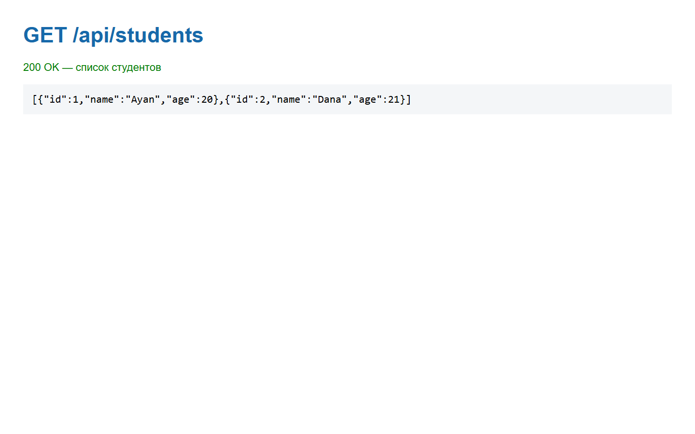
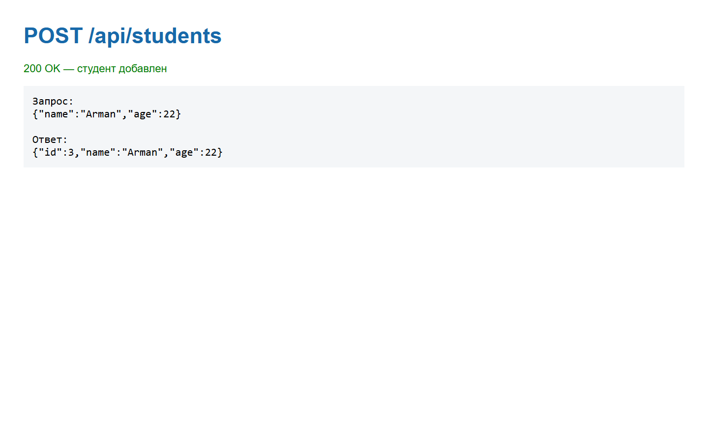
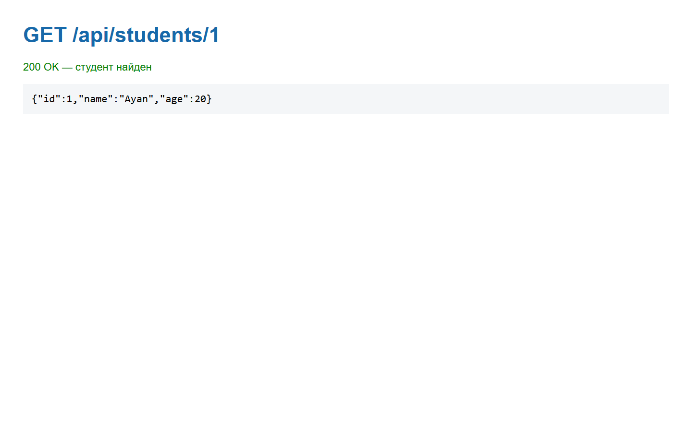
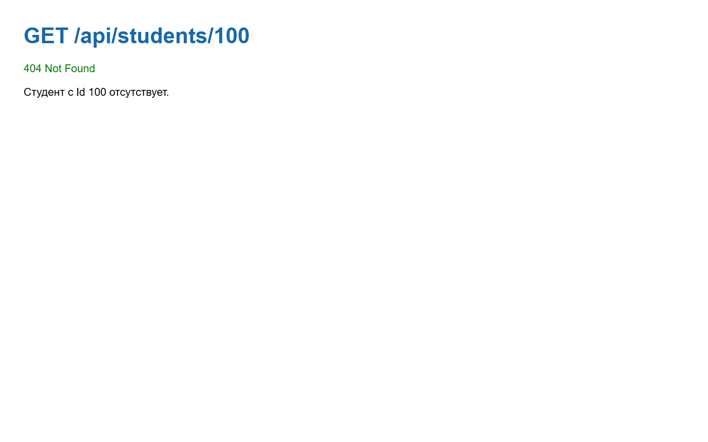

# WebApiHome1 — Модуль 01

## Краткий отчёт

Создан простой ASP.NET Core Web API на C# с контроллером `StudentsController`. Модель `Student` содержит Id, имя и возраст. Данные хранятся в памяти приложения, база данных не используется. API возвращает JSON и тестируется через Swagger.

## Реализованные операции

| Метод | Endpoint | Назначение |
|---|---|---|
| GET | `/api/students` | Получить список студентов |
| GET | `/api/students/{id}` | Получить студента по Id или вернуть `404 Not Found` |
| POST | `/api/students` | Добавить студента |

## Скриншоты выполнения

### Swagger и GET списка студентов

### POST — добавление Arman

### GET студента по Id

### GET отсутствующего студента

## Ответы на контрольные вопросы

1. Web API — программный интерфейс для обмена данными между приложениями через HTTP.
2. HTTP-запрос — обращение клиента к серверу с адресом, методом, заголовками и при необходимости телом.
3. HTTP-ответ — результат обработки запроса с кодом состояния, заголовками и данными.
4. GET используется для получения данных.
5. POST используется для добавления нового объекта.
6. `200 OK` означает успешное выполнение запроса.
7. `404 Not Found` означает, что ресурс не найден.
8. JSON — текстовый формат хранения и передачи структурированных данных.
9. Endpoint — конкретный адрес API, связанный с определённой операцией.
10. Swagger предназначен для просмотра и тестирования API в браузере.
